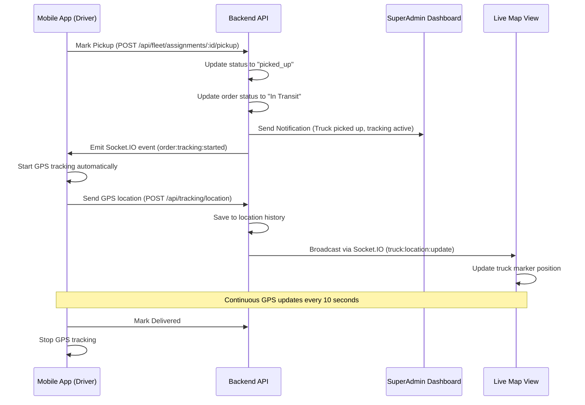

# Fleet Management & Live Tracking - Frontend Integration Guide

This guide provides comprehensive instructions for integrating the fleet management and live truck tracking system into your frontend application.

## Table of Contents

1. [API Endpoints](#api-endpoints)
2. [Socket.IO Integration](#socketio-integration)
3. [React Components](#react-components)
4. [Map Integration](#map-integration)
5. [State Management](#state-management)
6. [Authentication & Permissions](#authentication--permissions)
7. [Complete Mobile App GPS Tracking Flow](#complete-mobile-app-gps-tracking-flow)
8. [Example Implementations](#example-implementations)

---

## Overview: How GPS Tracking Works

**Complete Flow:**
1. **Truck Assignment**: Admin assigns truck to order → Status: "assigned"
2. **Driver Marks Pickup**: Driver confirms pickup at warehouse via mobile app → Status: "picked_up", Order: "In Transit"
3. **Superadmin Notification**: Superadmin receives high-priority notification that GPS tracking is active
4. **Mobile GPS Starts**: Mobile app automatically starts sending location updates every 10 seconds via GPS
5. **Live Map Updates**: Superadmin and authorized users see real-time truck location on map via Socket.IO
6. **Driver Marks Delivery**: Driver confirms delivery → Status: "delivered", GPS tracking stops automatically

**Key Points:**
- GPS tracking only starts when driver marks pickup (not when truck is assigned)
- Mobile app listens for pickup confirmation and automatically begins GPS tracking
- Location updates are sent continuously while status is "picked_up" or "in_transit"
- Superadmin is notified immediately when pickup is confirmed
- All authorized users can view live location on map in real-time

---

## API Endpoints

### Base URL
All endpoints are prefixed with `/api`

### Authentication
Include JWT token in headers:
```javascript
headers: {
  'Authorization': `Bearer ${token}`,
  'Content-Type': 'application/json'
}
```

---

### Warehouse Management

#### Get All Warehouses
```javascript
GET /api/warehouses?page=1&limit=10&search=&regionId=&areaId=&isActive=true

Response:
{
  warehouses: [...],
  total: 50,
  page: 1,
  totalPages: 5
}
```

#### Get Nearest Warehouse
```javascript
GET /api/warehouses/nearest?lat=19.0760&lng=72.8777&regionId=uuid

Response:
{
  warehouse: { id, name, warehouseCode, lat, lng, address, ... },
  distance: 12.5 // in kilometers
}
```

#### Create Warehouse
```javascript
POST /api/warehouses
Body: {
  warehouseCode: "WH001",
  name: "Mumbai Central Warehouse",
  address: "123 Street",
  city: "Mumbai",
  state: "Maharashtra",
  pincode: "400001",
  lat: 19.0760,
  lng: 72.8777,
  regionId: "uuid",
  areaId: "uuid", // optional
  contactPerson: "John Doe",
  phoneNumber: "1234567890",
  email: "warehouse@example.com"
}
```

#### Update Warehouse
```javascript
PUT /api/warehouses/:id
Body: { /* same as create */ }
```

#### Delete Warehouse (Soft Delete)
```javascript
DELETE /api/warehouses/:id
```

---

### Truck Management

#### Get All Trucks
```javascript
GET /api/trucks?page=1&limit=10&search=&status=available&regionId=&isActive=true

Response:
{
  trucks: [...],
  total: 30,
  page: 1,
  totalPages: 3
}
```

#### Get Truck Details
```javascript
GET /api/trucks/:id

Response: {
  id, truckName, licenseNumber, truckType, capacity,
  status, currentLat, currentLng, lastLocationUpdate,
  region, assignments: [...]
}
```

#### Create Truck
```javascript
POST /api/trucks
Body: {
  truckName: "Truck-001",
  licenseNumber: "MH-01-AB-1234",
  truckType: "medium", // small, medium, large
  capacity: 5.5, // in tons
  regionId: "uuid" // optional
}
```

#### Update Truck
```javascript
PUT /api/trucks/:id
Body: { /* same as create */ }
```

#### Get Truck Location
```javascript
GET /api/trucks/:id/location

Response: {
  truckId, truckName, licenseNumber,
  lat, lng, lastUpdate
}
```

#### Get Truck Location History
```javascript
GET /api/trucks/:id/history?startDate=2025-01-01&endDate=2025-01-31&limit=100

Response: {
  history: [
    { lat, lng, speed, heading, timestamp },
    ...
  ]
}
```

---

### Fleet Assignment

#### Assign Truck to Order
```javascript
POST /api/fleet/assign
Body: {
  orderId: "uuid",
  truckId: "uuid",
  warehouseId: "uuid",
  driverName: "John Driver",
  driverPhone: "9876543210", // optional
  estimatedDeliveryAt: "2025-01-15T10:00:00Z", // optional
  notes: "Handle with care" // optional
}

Response: {
  id, orderId, truckId, warehouseId,
  driverName, driverPhone, status: "assigned",
  assignedAt, estimatedDeliveryAt,
  order: {...},
  truck: {...},
  warehouse: {...}
}
```

#### Get All Assignments
```javascript
GET /api/fleet/assignments?page=1&limit=10&status=in_transit&orderId=&truckId=

Response: {
  assignments: [...],
  total: 20,
  page: 1,
  totalPages: 2
}
```

#### Get Assignment Details
```javascript
GET /api/fleet/assignments/:id

Response: {
  id, orderId, truckId, warehouseId,
  driverName, driverPhone, status,
  assignedAt, pickupAt, deliveredAt,
  estimatedDeliveryAt, notes,
  order: {...}, truck: {...}, warehouse: {...}
}
```

#### Mark Pickup
```javascript
POST /api/fleet/assignments/:id/pickup

Response: {
  // Updated assignment with status: "picked_up",
  // pickupAt timestamp, order status: "In Transit"
}
```

#### Mark Delivered
```javascript
POST /api/fleet/assignments/:id/deliver

Response: {
  // Updated assignment with status: "delivered",
  // deliveredAt timestamp, order status: "Delivered"
}
```

#### Update Assignment Status
```javascript
PATCH /api/fleet/assignments/:id/status
Body: {
  status: "in_transit", // assigned, picked_up, in_transit, delivered, cancelled
  notes: "Optional notes"
}
```

---

### Location Tracking

#### Update Truck Location (Mobile App)
```javascript
POST /api/tracking/location
Body: {
  truckId: "uuid",
  lat: 19.0760,
  lng: 72.8777,
  speed: 45.5, // optional, km/h
  heading: 90, // optional, degrees (0-360)
  timestamp: "2025-01-15T10:00:00Z" // optional, defaults to now
}

Response: {
  success: true,
  truckId, lat, lng, timestamp
}
```

**Note:** This endpoint has rate limiting (max 1 update per 10 seconds per truck).

#### Get Live Truck Locations
```javascript
GET /api/tracking/live

Response: {
  locations: [
    {
      assignmentId, orderId, orderNumber,
      truck: { id, truckName, licenseNumber, lat, lng, lastUpdate },
      warehouse: {...},
      status, driverName
    },
    ...
  ]
}
```

#### Get Order Tracking
```javascript
GET /api/tracking/order/:orderId

Response: {
  orderId, orderNumber, status,
  assignment: {
    id, status, driverName, driverPhone,
    assignedAt, pickupAt, deliveredAt, estimatedDeliveryAt,
    truck: { id, truckName, licenseNumber, currentLat, currentLng, lastLocationUpdate },
    warehouse: { id, name, lat, lng, address, city }
  },
  currentLocation: {
    lat, lng, lastUpdate
  },
  locationHistory: [
    { lat, lng, speed, heading, timestamp },
    ...
  ]
}
```

#### Get Truck Location History
```javascript
GET /api/tracking/truck/:truckId/history?startDate=&endDate=&limit=100

Response: {
  history: [...]
}
```

---

### Order Integration

#### Get Order Tracking
```javascript
GET /api/orders/:id/tracking

Response: {
  // Same as /api/tracking/order/:orderId
}
```

---

## Socket.IO Integration

### Connection Setup

```javascript
import io from 'socket.io-client';

const socket = io('http://localhost:3000', {
  auth: {
    token: localStorage.getItem('token')
  }
});

socket.on('connect', () => {
  console.log('Connected to server');
  
  // Authenticate socket
  socket.emit('authenticate', {
    token: localStorage.getItem('token')
  });
});

socket.on('authenticated', ({ ok, user }) => {
  if (ok) {
    console.log('Socket authenticated for user:', user);
  }
});
```

### Join Tracking Rooms

```javascript
// Track a specific truck
socket.emit('track_truck', { truckId: 'uuid' });

// Track a specific order
socket.emit('track_order', { orderId: 'uuid' });

// Join fleet scope (for managers)
socket.emit('join_fleet_scope', {
  regionId: 'uuid', // optional
  areaId: 'uuid'    // optional
});
```

### Listen to Events

#### Truck Location Updates
```javascript
socket.on('truck:location:update', (data) => {
  // data: {
  //   truckId, assignmentId, orderId,
  //   lat, lng, speed, heading, timestamp
  // }
  updateTruckLocationOnMap(data);
});
```

#### Truck Status Changes
```javascript
socket.on('truck:status:change', (data) => {
  // data: {
  //   truckId, assignmentId, status, orderId
  // }
  updateAssignmentStatus(data);
});
```

#### Order Tracking Updates
```javascript
socket.on('order:tracking:update', (data) => {
  // data: {
  //   orderId,
  //   assignment: { id, status },
  //   currentLocation: { lat, lng, speed, heading, timestamp }
  // }
  updateOrderTracking(data);
});
```

### Leave Rooms

```javascript
socket.emit('untrack_truck', { truckId: 'uuid' });
socket.emit('untrack_order', { orderId: 'uuid' });
```

---

## React Components

### 1. Warehouse Management Component

```jsx
import React, { useState, useEffect } from 'react';
import axios from 'axios';

const WarehouseManagement = () => {
  const [warehouses, setWarehouses] = useState([]);
  const [loading, setLoading] = useState(true);

  useEffect(() => {
    fetchWarehouses();
  }, []);

  const fetchWarehouses = async () => {
    try {
      const response = await axios.get('/api/warehouses', {
        headers: {
          Authorization: `Bearer ${localStorage.getItem('token')}`
        }
      });
      setWarehouses(response.data.warehouses);
    } catch (error) {
      console.error('Error fetching warehouses:', error);
    } finally {
      setLoading(false);
    }
  };

  const createWarehouse = async (warehouseData) => {
    try {
      const response = await axios.post('/api/warehouses', warehouseData, {
        headers: {
          Authorization: `Bearer ${localStorage.getItem('token')}`
        }
      });
      setWarehouses([...warehouses, response.data]);
    } catch (error) {
      console.error('Error creating warehouse:', error);
      throw error;
    }
  };

  if (loading) return <div>Loading...</div>;

  return (
    <div>
      <h2>Warehouses</h2>
      <button onClick={() => setShowCreateModal(true)}>Create Warehouse</button>
      <table>
        <thead>
          <tr>
            <th>Code</th>
            <th>Name</th>
            <th>Location</th>
            <th>Status</th>
            <th>Actions</th>
          </tr>
        </thead>
        <tbody>
          {warehouses.map(wh => (
            <tr key={wh.id}>
              <td>{wh.warehouseCode}</td>
              <td>{wh.name}</td>
              <td>{wh.city}, {wh.state}</td>
              <td>{wh.isActive ? 'Active' : 'Inactive'}</td>
              <td>
                <button onClick={() => editWarehouse(wh)}>Edit</button>
                <button onClick={() => deleteWarehouse(wh.id)}>Delete</button>
              </td>
            </tr>
          ))}
        </tbody>
      </table>
    </div>
  );
};
```

### 2. Truck Assignment Component

```jsx
import React, { useState, useEffect } from 'react';
import axios from 'axios';

const TruckAssignment = ({ orderId }) => {
  const [trucks, setTrucks] = useState([]);
  const [warehouses, setWarehouses] = useState([]);
  const [formData, setFormData] = useState({
    truckId: '',
    warehouseId: '',
    driverName: '',
    driverPhone: '',
    estimatedDeliveryAt: ''
  });

  useEffect(() => {
    fetchAvailableTrucks();
    fetchWarehouses();
  }, []);

  const fetchAvailableTrucks = async () => {
    try {
      const response = await axios.get('/api/trucks?status=available', {
        headers: { Authorization: `Bearer ${localStorage.getItem('token')}` }
      });
      setTrucks(response.data.trucks);
    } catch (error) {
      console.error('Error fetching trucks:', error);
    }
  };

  const fetchWarehouses = async () => {
    try {
      const response = await axios.get('/api/warehouses?isActive=true', {
        headers: { Authorization: `Bearer ${localStorage.getItem('token')}` }
      });
      setWarehouses(response.data.warehouses);
    } catch (error) {
      console.error('Error fetching warehouses:', error);
    }
  };

  const handleAssign = async (e) => {
    e.preventDefault();
    try {
      await axios.post('/api/fleet/assign', {
        orderId,
        ...formData
      }, {
        headers: { Authorization: `Bearer ${localStorage.getItem('token')}` }
      });
      alert('Truck assigned successfully!');
      // Refresh order data
    } catch (error) {
      console.error('Error assigning truck:', error);
      alert('Failed to assign truck: ' + error.response?.data?.error);
    }
  };

  return (
    <form onSubmit={handleAssign}>
      <h3>Assign Truck to Order</h3>
      
      <div>
        <label>Select Truck:</label>
        <select
          value={formData.truckId}
          onChange={(e) => setFormData({...formData, truckId: e.target.value})}
          required
        >
          <option value="">Select a truck</option>
          {trucks.map(truck => (
            <option key={truck.id} value={truck.id}>
              {truck.truckName} - {truck.licenseNumber}
            </option>
          ))}
        </select>
      </div>

      <div>
        <label>Select Warehouse:</label>
        <select
          value={formData.warehouseId}
          onChange={(e) => setFormData({...formData, warehouseId: e.target.value})}
          required
        >
          <option value="">Select a warehouse</option>
          {warehouses.map(wh => (
            <option key={wh.id} value={wh.id}>
              {wh.name} - {wh.city}
            </option>
          ))}
        </select>
      </div>

      <div>
        <label>Driver Name:</label>
        <input
          type="text"
          value={formData.driverName}
          onChange={(e) => setFormData({...formData, driverName: e.target.value})}
          required
        />
      </div>

      <div>
        <label>Driver Phone:</label>
        <input
          type="tel"
          value={formData.driverPhone}
          onChange={(e) => setFormData({...formData, driverPhone: e.target.value})}
        />
      </div>

      <div>
        <label>Estimated Delivery:</label>
        <input
          type="datetime-local"
          value={formData.estimatedDeliveryAt}
          onChange={(e) => setFormData({...formData, estimatedDeliveryAt: e.target.value})}
        />
      </div>

      <button type="submit">Assign Truck</button>
    </form>
  );
};
```

### 3. Live Tracking Map Component

```jsx
import React, { useState, useEffect, useRef } from 'react';
import { MapContainer, TileLayer, Marker, Popup, Polyline } from 'react-leaflet';
import L from 'leaflet';
import io from 'socket.io-client';

// Fix for default marker icon
delete L.Icon.Default.prototype._getIconUrl;
L.Icon.Default.mergeOptions({
  iconRetinaUrl: 'https://cdnjs.cloudflare.com/ajax/libs/leaflet/1.7.1/images/marker-icon-2x.png',
  iconUrl: 'https://cdnjs.cloudflare.com/ajax/libs/leaflet/1.7.1/images/marker-icon.png',
  shadowUrl: 'https://cdnjs.cloudflare.com/ajax/libs/leaflet/1.7.1/images/marker-shadow.png',
});

const LiveTrackingMap = ({ orderId }) => {
  const [trackingData, setTrackingData] = useState(null);
  const [truckLocation, setTruckLocation] = useState(null);
  const socketRef = useRef(null);

  useEffect(() => {
    // Fetch initial tracking data
    fetchTrackingData();

    // Setup Socket.IO
    socketRef.current = io('http://localhost:3000', {
      auth: { token: localStorage.getItem('token') }
    });

    socketRef.current.on('connect', () => {
      socketRef.current.emit('authenticate', {
        token: localStorage.getItem('token')
      });
      socketRef.current.emit('track_order', { orderId });
    });

    socketRef.current.on('order:tracking:update', (data) => {
      if (data.orderId === orderId) {
        setTruckLocation(data.currentLocation);
      }
    });

    socketRef.current.on('truck:location:update', (data) => {
      if (data.orderId === orderId) {
        setTruckLocation({
          lat: data.lat,
          lng: data.lng,
          lastUpdate: data.timestamp
        });
      }
    });

    return () => {
      if (socketRef.current) {
        socketRef.current.emit('untrack_order', { orderId });
        socketRef.current.disconnect();
      }
    };
  }, [orderId]);

  const fetchTrackingData = async () => {
    try {
      const response = await axios.get(`/api/orders/${orderId}/tracking`, {
        headers: { Authorization: `Bearer ${localStorage.getItem('token')}` }
      });
      setTrackingData(response.data);
      if (response.data.currentLocation) {
        setTruckLocation(response.data.currentLocation);
      }
    } catch (error) {
      console.error('Error fetching tracking data:', error);
    }
  };

  if (!trackingData) return <div>Loading tracking data...</div>;

  const { assignment, locationHistory } = trackingData;
  const warehouse = assignment?.warehouse;
  const dealer = trackingData.order?.dealer; // You'll need to fetch dealer location

  // Build route path
  const routePath = [];
  if (warehouse) routePath.push([warehouse.lat, warehouse.lng]);
  if (locationHistory && locationHistory.length > 0) {
    locationHistory.reverse().forEach(point => {
      routePath.push([point.lat, point.lng]);
    });
  }
  if (truckLocation) routePath.push([truckLocation.lat, truckLocation.lng]);
  if (dealer) routePath.push([dealer.lat, dealer.lng]);

  return (
    <div style={{ height: '600px', width: '100%' }}>
      <MapContainer
        center={truckLocation ? [truckLocation.lat, truckLocation.lng] : [19.0760, 72.8777]}
        zoom={10}
        style={{ height: '100%', width: '100%' }}
      >
        <TileLayer
          url="https://{s}.tile.openstreetmap.org/{z}/{x}/{y}.png"
          attribution='&copy; <a href="https://www.openstreetmap.org/copyright">OpenStreetMap</a>'
        />

        {/* Warehouse Marker */}
        {warehouse && (
          <Marker position={[warehouse.lat, warehouse.lng]}>
            <Popup>
              <strong>Warehouse: {warehouse.name}</strong><br />
              {warehouse.address}
            </Popup>
          </Marker>
        )}

        {/* Truck Current Location */}
        {truckLocation && (
          <Marker position={[truckLocation.lat, truckLocation.lng]}>
            <Popup>
              <strong>Truck: {assignment?.truck?.truckName}</strong><br />
              Driver: {assignment?.driverName}<br />
              Status: {assignment?.status}<br />
              Last Update: {new Date(truckLocation.lastUpdate).toLocaleString()}
            </Popup>
          </Marker>
        )}

        {/* Dealer/Destination Marker */}
        {dealer && (
          <Marker position={[dealer.lat, dealer.lng]}>
            <Popup>
              <strong>Destination: {dealer.businessName}</strong><br />
              {dealer.address}
            </Popup>
          </Marker>
        )}

        {/* Route Path */}
        {routePath.length > 1 && (
          <Polyline
            positions={routePath}
            color="blue"
            weight={3}
            opacity={0.7}
          />
        )}
      </MapContainer>
    </div>
  );
};
```

### 4. Order Tracking Component

```jsx
import React, { useState, useEffect } from 'react';
import axios from 'axios';
import LiveTrackingMap from './LiveTrackingMap';

const OrderTracking = ({ orderId }) => {
  const [trackingData, setTrackingData] = useState(null);
  const [loading, setLoading] = useState(true);

  useEffect(() => {
    fetchTrackingData();
    const interval = setInterval(fetchTrackingData, 30000); // Refresh every 30 seconds
    return () => clearInterval(interval);
  }, [orderId]);

  const fetchTrackingData = async () => {
    try {
      const response = await axios.get(`/api/orders/${orderId}/tracking`, {
        headers: { Authorization: `Bearer ${localStorage.getItem('token')}` }
      });
      setTrackingData(response.data);
    } catch (error) {
      console.error('Error fetching tracking data:', error);
    } finally {
      setLoading(false);
    }
  };

  const handlePickup = async () => {
    try {
      await axios.post(`/api/fleet/assignments/${trackingData.assignment.id}/pickup`, {}, {
        headers: { Authorization: `Bearer ${localStorage.getItem('token')}` }
      });
      fetchTrackingData();
    } catch (error) {
      console.error('Error marking pickup:', error);
    }
  };

  const handleDeliver = async () => {
    try {
      await axios.post(`/api/fleet/assignments/${trackingData.assignment.id}/deliver`, {}, {
        headers: { Authorization: `Bearer ${localStorage.getItem('token')}` }
      });
      fetchTrackingData();
    } catch (error) {
      console.error('Error marking delivered:', error);
    }
  };

  if (loading) return <div>Loading...</div>;

  if (!trackingData.hasAssignment) {
    return (
      <div>
        <p>No truck assigned to this order yet.</p>
        <TruckAssignment orderId={orderId} onAssigned={fetchTrackingData} />
      </div>
    );
  }

  const { assignment, currentLocation } = trackingData;

  return (
    <div>
      <h2>Order Tracking: {trackingData.orderNumber}</h2>
      
      <div style={{ display: 'grid', gridTemplateColumns: '1fr 1fr', gap: '20px' }}>
        <div>
          <h3>Assignment Details</h3>
          <p><strong>Truck:</strong> {assignment.truck.truckName} ({assignment.truck.licenseNumber})</p>
          <p><strong>Driver:</strong> {assignment.driverName}</p>
          <p><strong>Status:</strong> {assignment.status}</p>
          <p><strong>Warehouse:</strong> {assignment.warehouse.name}</p>
          <p><strong>Assigned At:</strong> {new Date(assignment.assignedAt).toLocaleString()}</p>
          {assignment.pickupAt && (
            <p><strong>Picked Up At:</strong> {new Date(assignment.pickupAt).toLocaleString()}</p>
          )}
          {assignment.estimatedDeliveryAt && (
            <p><strong>Estimated Delivery:</strong> {new Date(assignment.estimatedDeliveryAt).toLocaleString()}</p>
          )}

          {assignment.status === 'assigned' && (
            <button onClick={handlePickup}>Mark as Picked Up</button>
          )}
          {assignment.status === 'in_transit' && (
            <button onClick={handleDeliver}>Mark as Delivered</button>
          )}
        </div>

        <div>
          <h3>Current Location</h3>
          {currentLocation ? (
            <>
              <p><strong>Latitude:</strong> {currentLocation.lat}</p>
              <p><strong>Longitude:</strong> {currentLocation.lng}</p>
              <p><strong>Last Update:</strong> {new Date(currentLocation.lastUpdate).toLocaleString()}</p>
            </>
          ) : (
            <p>No location data available</p>
          )}
        </div>
      </div>

      <div style={{ marginTop: '20px' }}>
        <LiveTrackingMap orderId={orderId} />
      </div>

      <div style={{ marginTop: '20px' }}>
        <h3>Location History</h3>
        <table>
          <thead>
            <tr>
              <th>Time</th>
              <th>Latitude</th>
              <th>Longitude</th>
              <th>Speed</th>
              <th>Heading</th>
            </tr>
          </thead>
          <tbody>
            {trackingData.locationHistory.map((point, idx) => (
              <tr key={idx}>
                <td>{new Date(point.timestamp).toLocaleString()}</td>
                <td>{point.lat.toFixed(6)}</td>
                <td>{point.lng.toFixed(6)}</td>
                <td>{point.speed || 'N/A'} km/h</td>
                <td>{point.heading || 'N/A'}°</td>
              </tr>
            ))}
          </tbody>
        </table>
      </div>
    </div>
  );
};
```

---

## Map Integration

### Using React Leaflet

Install dependencies:
```bash
npm install react-leaflet leaflet
npm install --save-dev @types/leaflet
```

Import CSS:
```javascript
import 'leaflet/dist/leaflet.css';
```

### Map Features to Implement

1. **Truck Markers**: Show trucks as moving markers on the map
2. **Route Visualization**: Draw route from warehouse → current location → destination
3. **Info Popups**: Show truck details, driver info, order number on marker click
4. **Real-time Updates**: Update marker positions via Socket.IO
5. **Status Colors**: Color-code markers by status (available, in transit, delivered)

### Example Map Marker Styling

```javascript
import L from 'leaflet';

const createTruckIcon = (status) => {
  const colors = {
    available: 'green',
    assigned: 'yellow',
    in_transit: 'blue',
    delivered: 'gray'
  };

  return L.divIcon({
    className: 'truck-marker',
    html: `<div style="
      width: 30px;
      height: 30px;
      background-color: ${colors[status] || 'gray'};
      border-radius: 50%;
      border: 2px solid white;
      box-shadow: 0 2px 4px rgba(0,0,0,0.3);
    "></div>`,
    iconSize: [30, 30]
  });
};
```

---

## State Management

### Using Redux (Example)

```javascript
// store/slices/fleetSlice.js
import { createSlice, createAsyncThunk } from '@reduxjs/toolkit';
import axios from 'axios';

export const fetchTrucks = createAsyncThunk(
  'fleet/fetchTrucks',
  async (filters) => {
    const response = await axios.get('/api/trucks', {
      params: filters,
      headers: { Authorization: `Bearer ${localStorage.getItem('token')}` }
    });
    return response.data;
  }
);

export const assignTruck = createAsyncThunk(
  'fleet/assignTruck',
  async (assignmentData) => {
    const response = await axios.post('/api/fleet/assign', assignmentData, {
      headers: { Authorization: `Bearer ${localStorage.getItem('token')}` }
    });
    return response.data;
  }
);

const fleetSlice = createSlice({
  name: 'fleet',
  initialState: {
    trucks: [],
    assignments: [],
    liveLocations: {},
    loading: false,
    error: null
  },
  reducers: {
    updateTruckLocation: (state, action) => {
      const { truckId, lat, lng } = action.payload;
      state.liveLocations[truckId] = { lat, lng, timestamp: new Date() };
    }
  },
  extraReducers: (builder) => {
    builder
      .addCase(fetchTrucks.pending, (state) => {
        state.loading = true;
      })
      .addCase(fetchTrucks.fulfilled, (state, action) => {
        state.loading = false;
        state.trucks = action.payload.trucks;
      })
      .addCase(assignTruck.fulfilled, (state, action) => {
        state.assignments.push(action.payload);
      });
  }
});

export const { updateTruckLocation } = fleetSlice.actions;
export default fleetSlice.reducer;
```

---

## Authentication & Permissions

### Check Permissions Before Rendering

```javascript
import { useSelector } from 'react-redux';

const FleetManagement = () => {
  const user = useSelector(state => state.auth.user);
  const permissions = useSelector(state => state.auth.permissions);

  const canViewFleet = permissions.includes('fleet.view');
  const canManageFleet = permissions.includes('fleet.manage');
  const canAssignTruck = permissions.includes('fleet.assign');
  const canTrack = permissions.includes('fleet.track');

  if (!canViewFleet) {
    return <div>You don't have permission to view fleet management.</div>;
  }

  return (
    <div>
      {canManageFleet && <TruckManagement />}
      {canAssignTruck && <TruckAssignment />}
      {canTrack && <LiveTrackingMap />}
    </div>
  );
};
```

### Permission-Based Route Guards

```javascript
// routes/ProtectedRoute.js
import { Navigate } from 'react-router-dom';
import { useSelector } from 'react-redux';

const ProtectedRoute = ({ children, requiredPermission }) => {
  const permissions = useSelector(state => state.auth.permissions);
  const hasPermission = !requiredPermission || permissions.includes(requiredPermission);

  if (!hasPermission) {
    return <Navigate to="/unauthorized" />;
  }

  return children;
};

// Usage
<Route
  path="/fleet"
  element={
    <ProtectedRoute requiredPermission="fleet.view">
      <FleetManagement />
    </ProtectedRoute>
  }
/>
```

---

## Example Implementations

### Complete Fleet Dashboard

```jsx
import React, { useState } from 'react';
import { Tabs, Tab } from '@mui/material'; // or your UI library
import WarehouseManagement from './WarehouseManagement';
import TruckManagement from './TruckManagement';
import FleetAssignments from './FleetAssignments';
import LiveTracking from './LiveTracking';

const FleetDashboard = () => {
  const [activeTab, setActiveTab] = useState(0);

  return (
    <div>
      <h1>Fleet Management</h1>
      <Tabs value={activeTab} onChange={(e, v) => setActiveTab(v)}>
        <Tab label="Warehouses" />
        <Tab label="Trucks" />
        <Tab label="Assignments" />
        <Tab label="Live Tracking" />
      </Tabs>

      {activeTab === 0 && <WarehouseManagement />}
      {activeTab === 1 && <TruckManagement />}
      {activeTab === 2 && <FleetAssignments />}
      {activeTab === 3 && <LiveTracking />}
    </div>
  );
};
```

### Mobile App Integration (Location Updates)

**Important Flow:**
1. Driver marks pickup via mobile app → Backend updates status to "picked_up"
2. Superadmin receives notification that tracking is active
3. Mobile app automatically starts sending GPS location updates
4. Backend receives updates and broadcasts via Socket.IO
5. Superadmin and authorized users see live location on map

```javascript
// Mobile app - React Native example
import Geolocation from '@react-native-community/geolocation';
import axios from 'axios';
import io from 'socket.io-client';

class LocationTracker {
  constructor(truckId, assignmentId) {
    this.truckId = truckId;
    this.assignmentId = assignmentId;
    this.watchId = null;
    this.lastUpdate = 0;
    this.RATE_LIMIT_MS = 10000; // 10 seconds
    this.isTracking = false;
    this.socket = null;
  }

  // Initialize and check if tracking should be active
  async initialize() {
    try {
      // Get assignment status
      const response = await axios.get(
        `/api/fleet/assignments/${this.assignmentId}`,
        {
          headers: { Authorization: `Bearer ${this.getToken()}` }
        }
      );

      const assignment = response.data;
      
      // Start tracking if status is "picked_up" or "in_transit"
      if (assignment.status === 'picked_up' || assignment.status === 'in_transit') {
        this.startTracking();
      } else {
        // Listen for status changes via Socket.IO
        this.setupSocketListener();
      }
    } catch (error) {
      console.error('Error initializing tracker:', error);
    }
  }

  // Setup Socket.IO to listen for pickup status
  setupSocketListener() {
    this.socket = io('http://your-api.com', {
      auth: { token: this.getToken() }
    });

    this.socket.on('connect', () => {
      this.socket.emit('authenticate', { token: this.getToken() });
      this.socket.emit('track_truck', { truckId: this.truckId });
    });

    // Listen for status change to "picked_up" - then start tracking
    this.socket.on('truck:status:change', (data) => {
      if (data.assignmentId === this.assignmentId && 
          (data.status === 'picked_up' || data.status === 'in_transit')) {
        console.log('Pickup confirmed - starting GPS tracking');
        this.startTracking();
      }
    });

    // Listen for tracking started event
    this.socket.on('order:tracking:started', (data) => {
      if (data.assignmentId === this.assignmentId) {
        console.log('Tracking started - beginning GPS updates');
        this.startTracking();
      }
    });
  }

  // Start GPS tracking
  startTracking() {
    if (this.isTracking) {
      console.log('Tracking already active');
      return;
    }

    this.isTracking = true;
    console.log('Starting GPS location tracking...');

    // Request location permissions (React Native)
    Geolocation.requestAuthorization();

    this.watchId = Geolocation.watchPosition(
      (position) => {
        const now = Date.now();
        if (now - this.lastUpdate < this.RATE_LIMIT_MS) {
          return; // Rate limit
        }

        this.sendLocation({
          truckId: this.truckId,
          lat: position.coords.latitude,
          lng: position.coords.longitude,
          speed: position.coords.speed ? position.coords.speed * 3.6 : null, // Convert m/s to km/h
          heading: position.coords.heading,
          timestamp: new Date().toISOString()
        });

        this.lastUpdate = now;
      },
      (error) => {
        console.error('Location error:', error);
        // Handle location errors (permission denied, etc.)
      },
      {
        enableHighAccuracy: true,
        timeout: 15000,
        maximumAge: 0,
        distanceFilter: 10 // Only update if moved 10 meters (optional optimization)
      }
    );
  }

  // Send location to backend
  async sendLocation(locationData) {
    try {
      const response = await axios.post(
        'http://your-api.com/api/tracking/location',
        locationData,
        {
          headers: {
            Authorization: `Bearer ${this.getToken()}`,
            'Content-Type': 'application/json'
          }
        }
      );
      
      console.log('Location sent successfully:', response.data);
    } catch (error) {
      console.error('Error sending location:', error);
      // Retry logic can be added here
    }
  }

  // Mark pickup (called when driver confirms pickup at warehouse)
  async markPickup() {
    try {
      const response = await axios.post(
        `/api/fleet/assignments/${this.assignmentId}/pickup`,
        {},
        {
          headers: { Authorization: `Bearer ${this.getToken()}` }
        }
      );

      console.log('Pickup marked successfully');
      // Tracking will start automatically via Socket.IO event
      // But we can also start it immediately
      this.startTracking();
      
      return response.data;
    } catch (error) {
      console.error('Error marking pickup:', error);
      throw error;
    }
  }

  // Mark delivered (stops tracking)
  async markDelivered() {
    try {
      const response = await axios.post(
        `/api/fleet/assignments/${this.assignmentId}/deliver`,
        {},
        {
          headers: { Authorization: `Bearer ${this.getToken()}` }
        }
      );

      // Stop tracking when delivered
      this.stopTracking();
      
      return response.data;
    } catch (error) {
      console.error('Error marking delivered:', error);
      throw error;
    }
  }

  // Stop tracking
  stopTracking() {
    if (this.watchId !== null) {
      Geolocation.clearWatch(this.watchId);
      this.watchId = null;
    }
    this.isTracking = false;
    
    if (this.socket) {
      this.socket.disconnect();
    }
    
    console.log('GPS tracking stopped');
  }
}

// Usage in mobile app
// When driver logs in and sees their assignment:
const tracker = new LocationTracker(truckId, assignmentId);
await tracker.initialize();

// When driver arrives at warehouse and picks up:
await tracker.markPickup(); // This triggers notification to superadmin

// When driver delivers:
await tracker.markDelivered(); // This stops tracking
```

---

## Complete Mobile App GPS Tracking Flow

### Business Process Flow



### Step-by-Step Implementation

#### 1. Driver Login & Assignment View
```javascript
// Mobile app - Driver sees their assignments
const DriverDashboard = () => {
  const [assignments, setAssignments] = useState([]);

  useEffect(() => {
    fetchMyAssignments();
  }, []);

  const fetchMyAssignments = async () => {
    // Get assignments for driver's truck
    const response = await axios.get('/api/fleet/assignments', {
      params: { truckId: currentTruckId, status: 'assigned' },
      headers: { Authorization: `Bearer ${token}` }
    });
    setAssignments(response.data.assignments);
  };

  return (
    <div>
      <h2>My Assignments</h2>
      {assignments.map(assignment => (
        <AssignmentCard
          key={assignment.id}
          assignment={assignment}
          onPickup={() => handlePickup(assignment.id)}
        />
      ))}
    </div>
  );
};
```

#### 2. Driver Marks Pickup
```javascript
const handlePickup = async (assignmentId) => {
  try {
    // Mark pickup
    await axios.post(`/api/fleet/assignments/${assignmentId}/pickup`, {}, {
      headers: { Authorization: `Bearer ${token}` }
    });

    // Initialize location tracker
    const tracker = new LocationTracker(truckId, assignmentId);
    await tracker.initialize(); // This starts GPS tracking automatically

    alert('Pickup confirmed! GPS tracking is now active.');
  } catch (error) {
    console.error('Error marking pickup:', error);
  }
};
```

#### 3. Automatic GPS Tracking Starts
The `LocationTracker` class automatically:
- Listens for Socket.IO event confirming pickup
- Starts GPS tracking when status becomes "picked_up" or "in_transit"
- Sends location updates every 10 seconds (respecting rate limit)
- Continues until delivery is marked

#### 4. Superadmin Receives Notification
When pickup is marked:
- Superadmin gets a high-priority notification
- Notification includes: truck name, license number, order number, warehouse name
- Message: "Location tracking is now active via mobile GPS"
- Clicking notification opens the assignment/tracking page

#### 5. Live Map Updates
- Superadmin (and authorized users) can view live map
- Truck location updates in real-time via Socket.IO
- Shows route from warehouse → current location → dealer destination

### Mobile App Driver Screen Example

```javascript
// Complete driver assignment screen
const DriverAssignmentScreen = ({ assignmentId }) => {
  const [assignment, setAssignment] = useState(null);
  const [tracker, setTracker] = useState(null);
  const [isTracking, setIsTracking] = useState(false);

  useEffect(() => {
    fetchAssignment();
    initializeTracker();
  }, [assignmentId]);

  const fetchAssignment = async () => {
    const response = await axios.get(`/api/fleet/assignments/${assignmentId}`, {
      headers: { Authorization: `Bearer ${token}` }
    });
    setAssignment(response.data);
  };

  const initializeTracker = () => {
    const locationTracker = new LocationTracker(
      assignment.truckId,
      assignmentId
    );
    locationTracker.initialize();
    setTracker(locationTracker);
  };

  const handlePickup = async () => {
    try {
      await tracker.markPickup();
      setIsTracking(true);
      // GPS tracking starts automatically
    } catch (error) {
      console.error('Pickup error:', error);
    }
  };

  const handleDeliver = async () => {
    try {
      await tracker.markDelivered();
      setIsTracking(false);
      // GPS tracking stops automatically
    } catch (error) {
      console.error('Delivery error:', error);
    }
  };

  return (
    <div>
      <h2>Assignment: {assignment?.order?.orderNumber}</h2>
      
      <div>
        <p><strong>Warehouse:</strong> {assignment?.warehouse?.name}</p>
        <p><strong>Destination:</strong> {assignment?.order?.dealer?.businessName}</p>
        <p><strong>Status:</strong> {assignment?.status}</p>
      </div>

      {assignment?.status === 'assigned' && (
        <button onClick={handlePickup}>
          Confirm Pickup at Warehouse
        </button>
      )}

      {isTracking && (
        <div>
          <p>📍 GPS Tracking Active</p>
          <p>Your location is being tracked in real-time</p>
        </div>
      )}

      {assignment?.status === 'in_transit' && (
        <button onClick={handleDeliver}>
          Mark as Delivered
        </button>
      )}
    </div>
  );
};
```

### Key Points:

1. **Pickup Triggers Tracking**: When driver marks pickup, backend:
   - Updates assignment status to "picked_up"
   - Updates order status to "In Transit"
   - Sends notification to superadmin
   - Emits Socket.IO event to mobile app

2. **Mobile App Auto-Starts GPS**: Mobile app listens for pickup confirmation and automatically starts GPS tracking

3. **Continuous Updates**: Mobile app sends GPS location every 10 seconds while status is "picked_up" or "in_transit"

4. **Superadmin Visibility**: Superadmin receives notification and can view live location on map immediately

5. **Delivery Stops Tracking**: When driver marks delivered, GPS tracking stops automatically

## Best Practices

1. **Error Handling**: Always wrap API calls in try-catch blocks
2. **Loading States**: Show loading indicators during API calls
3. **Optimistic Updates**: Update UI immediately, then sync with server
4. **Rate Limiting**: Respect rate limits on location updates (10 seconds)
5. **Reconnection**: Handle Socket.IO reconnection gracefully
6. **Permissions**: Always check permissions before showing UI elements
7. **Caching**: Cache warehouse and truck lists to reduce API calls
8. **Real-time Updates**: Use Socket.IO for live data, polling for fallback
9. **GPS Permissions**: Request location permissions when app starts
10. **Battery Optimization**: Use distanceFilter to reduce GPS updates when stationary

---

## Troubleshooting

### Socket.IO Not Connecting
- Check authentication token
- Verify CORS settings on backend
- Check Socket.IO version compatibility

### Map Not Rendering
- Ensure Leaflet CSS is imported
- Check map container has explicit height/width
- Verify coordinates are valid (lat: -90 to 90, lng: -180 to 180)

### Location Updates Not Working
- Check rate limiting (max 1 update per 10 seconds)
- Verify truck has active assignment
- Check mobile app permissions for location access

---

## Additional Resources

- [React Leaflet Documentation](https://react-leaflet.js.org/)
- [Socket.IO Client Documentation](https://socket.io/docs/v4/client-api/)
- [Leaflet Documentation](https://leafletjs.com/)

---

**Note**: Replace `http://localhost:3000` with your actual backend URL in production.

